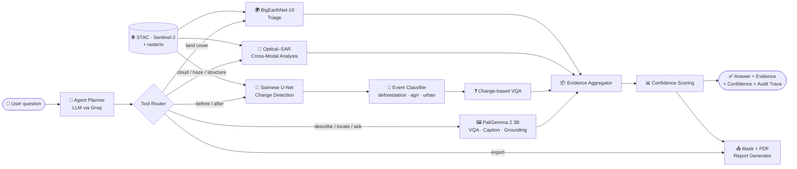
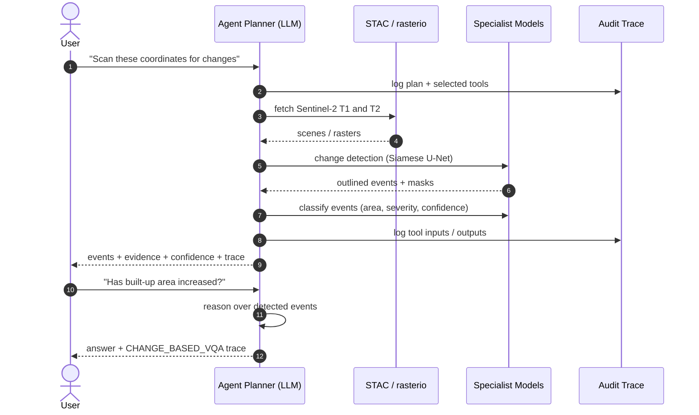
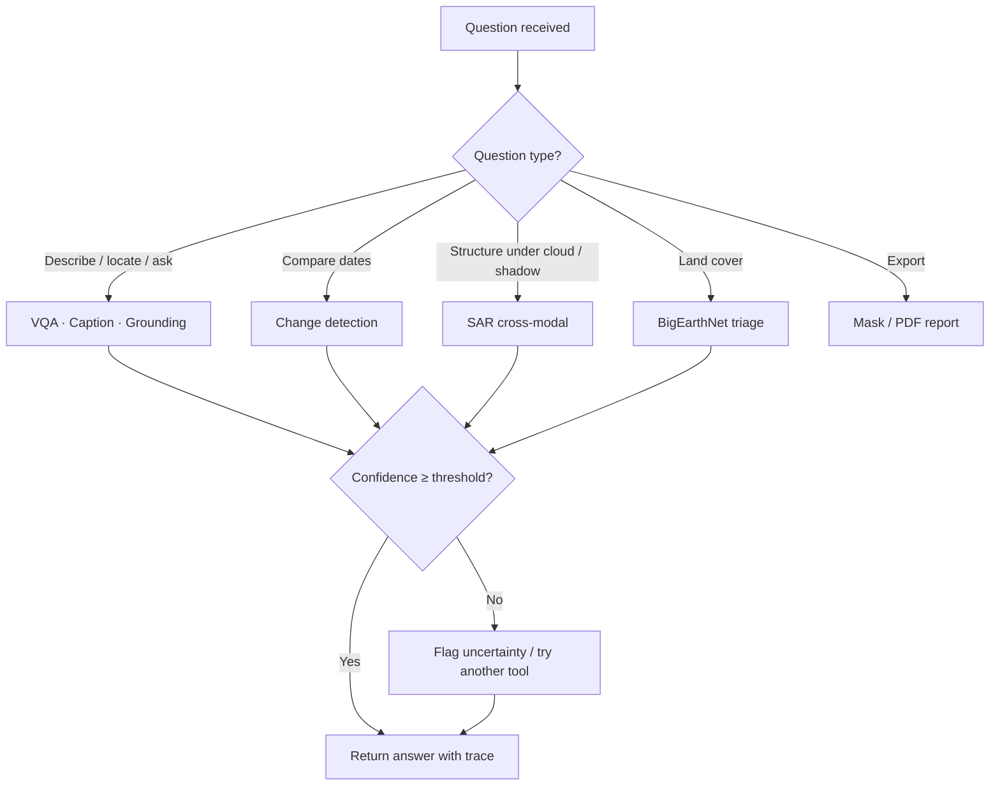

<div align="center">

# 🛰️ SatQuery AI

### Ask questions about satellite imagery in plain English. Get evidence-backed, confidence-scored, auditable answers.


[Overview](#-overview) · [Features](#-key-features) · [Demo](#-demo) · [Architecture](#-architecture) · [Model](#-model-card) · [Quick Start](#-quick-start) · [Roadmap](#-roadmap)

</div>

---

## 📌 Overview

Satellite imagery holds answers to questions about land-use change, vegetation loss, construction and infrastructure growth. Getting those answers today needs a GIS specialist, several tools and a lot of manual work.

**SatQuery AI** is an agentic assistant that closes this gap. A user asks a question in plain English. The agent decides which specialist model to run, executes it on the imagery, and returns an answer with **evidence**, a **confidence score** and a full **execution trace** so every result can be audited.

> **Example**
> *"Has the built-up area increased, decreased, or remained unchanged?"*
> → The agent runs change detection, lists the detected events (construction, deforestation, agricultural expansion) with area and confidence, reasons over them, and answers: *built-up area has increased*, with the trace that produced it.

---

## ✨ Key Features

| Capability | Description |
|---|---|
| 🗣️ **Natural-language interface** | Chat-style questions; no GIS or remote-sensing expertise needed. |
| 🧭 **Agentic tool routing** | An LLM planner (Groq) selects the right specialist for each request. |
| 🖼️ **Single-image VQA** | Fine-tuned **PaliGemma 2 (3B)** answers questions about one image. |
| 📝 **Image captioning** | Generates scene descriptions for high-resolution imagery. |
| 🎯 **Text-guided grounding** | Localizes objects named in the query (e.g. "building") with bounding boxes. |
| 🔄 **Bi-temporal change detection** | **Siamese U-Net** on Sentinel-2 T1 vs T2 scenes outputs outlined change events. |
| 🚨 **Violation patch detection** | Classifies events such as deforestation / tree clearing, agricultural expansion and urban or construction activity, each with a severity level, area (m²) and confidence. |
| ❓ **Change-based VQA** | Answers questions like *"Has built-up area increased?"* by reasoning over detected events. |
| 📡 **Optical–SAR cross-modal analysis** | SAR backscatter verifies built-up structures and sees through shadows, haze and cloud. |
| 🌍 **Land-cover triage** | BigEarthNet-19 semantic triage with a calibrated confidence score. |
| 📤 **Exportable outputs** | Download the spatial change mask and a PDF compliance report. |
| 🧾 **Auditable execution trace** | Every response carries a collapsible trace named for the tool path used. |

### Execution trace types

| Trace | Triggered by |
|---|---|
| `IMAGE_CAPTIONING` | "Describe this image" |
| `TEXT_GUIDED_GROUNDING` | "Locate buildings" |
| `CHANGE_BASED_VQA` | Questions about change between dates |
| `CROSS_MODAL_OPTICAL_SAR_ANALYSIS` | Optical + SAR verification |
| `COMPLIANCE_REPORT_GENERATION` | Mask / PDF export requests |

---

## 🖼️ Demo

<!-- TODO: save the screenshots into docs/images/ with these names -->

| Change detection (Sentinel-2) | Violation patches |
|---|---|
|  |  |

| Text-guided grounding | Image captioning |
|---|---|
|  |  |

| Optical–SAR cross-modal analysis | Change-based VQA |
|---|---|
|  |  |

---

## 🏗️ Architecture

### System overview



### Request lifecycle



### Agent decision flow



---

## 🧠 Model Card

| Item | Detail |
|---|---|
| Base model | PaliGemma 2 (3B) |
| Fine-tuning | PEFT / QLoRA adapter (`checkpoint-1500`) |
| Quantization | 4-bit NF4 |
| Tasks | VQA, captioning, grounding-style prompts |
| Training | Single-image model, about 23 hours of training |
| Data | Custom curated dataset, collected by **Ananya Tiwari** |
| Inference | Task-prefix prompts matching the training format |

> 💡 For best results, use the same task-style wording seen during training (e.g. VQA / Caption / Grounding prefixes).

---

## 🧰 Tech Stack

| Layer | Technology |
|---|---|
| Language | Python |
| Deep learning | PyTorch, PEFT / QLoRA, bitsandbytes (NF4) |
| Vision-language model | PaliGemma 2 3B (fine-tuned) |
| Change detection | Siamese U-Net |
| Agent / LLM planner | Groq-hosted LLM |
| Geospatial I/O | rasterio, STAC, Sentinel-2 |
| Frontend | Dark chat UI with change viewer and report export |

---

## 📁 Repository Structure

> Adjust to match your actual folders.

```text
satquery/
├── agent/                 # planner, tool router, confidence + audit trace
├── models/
│   ├── vqa/               # PaliGemma 2 + QLoRA adapter
│   ├── change_detection/  # Siamese U-Net
│   └── fusion/            # optical–SAR analysis
├── data/                  # STAC clients, rasterio loaders, preprocessing
├── reports/               # change mask + PDF compliance report generation
├── ui/                    # chat interface
├── docs/images/           # README screenshots
├── configs/
├── scripts/               # training / evaluation / inference
├── requirements.txt
└── README.md
```

---

## 🚀 Quick Start

### Prerequisites
- Python 3.10+
- A CUDA-capable GPU is recommended for inference and fine-tuning
- A Groq API key

### Installation

```bash
git clone https://github.com/create-codezero/satquery.git
cd satquery

python -m venv .venv
source .venv/bin/activate        # Windows: .venv\Scripts\activate

pip install -r requirements.txt
```

### Configuration

```bash
cp .env.example .env
# then set:
# GROQ_API_KEY=your_key_here
```

---

## 💡 Usage

```python
# Illustrative example. Update to match your actual entry point.
from satquery import SatQueryAgent

agent = SatQueryAgent()

result = agent.ask(
    question="Has the built-up area increased, decreased, or remained unchanged?",
    aoi="path/to/area_of_interest.geojson",
    date_range=("2022-01-01", "2025-01-01"),
)

print(result.answer)
print(result.confidence)
print(result.trace)      # full tool-call audit trail
```

---

## 📊 Results

<!-- TODO: fill in with real measured numbers. Do not publish unmeasured claims. -->

| Model | Task | Metric | Score |
|---|---|---|---|
| PaliGemma 2 (QLoRA) | VQA / captioning / grounding | Accuracy / BLEU / IoU | _TBD_ |
| Siamese U-Net | Change detection | F1 / IoU | _TBD_ |
| Optical–SAR analysis | Built-up verification | _TBD_ | _TBD_ |

---

## 🔍 Why SatQuery AI?

| | Typical GIS workflow | General VLM chatbot | **SatQuery AI** |
|---|---|---|---|
| Plain-English questions | ❌ | ✅ | ✅ |
| Specialist remote-sensing models | ✅ (manual) | ❌ | ✅ (automatic routing) |
| SAR + optical support | ✅ (manual) | ❌ | ✅ |
| Evidence and confidence per answer | ❌ | ❌ | ✅ |
| Auditable execution trace | ❌ | ❌ | ✅ |
| One-click mask / PDF report | ❌ | ❌ | ✅ |

---

## 🗺️ Roadmap

- [x] Agentic planner with tool routing
- [x] Fine-tuned single-image model (PaliGemma 2, QLoRA)
- [x] Change detection with violation patch classification
- [x] Optical–SAR cross-modal analysis
- [x] Mask and PDF report export
- [x] Auditable execution trace
- [ ] Quantitative benchmark on remote-sensing agent tasks
- [ ] Confidence calibration for land-cover triage
- [ ] Multi-image / temporal-series VQA
- [ ] Docker image and one-command deployment

---

## 🏆 Recognition

- **Smart India Hackathon 2026**: selected in the internal round.

---

## 🤝 Contributing

1. Fork the repository
2. Create a branch: `git checkout -b feature/your-feature`
3. Commit your changes: `git commit -m "Add your feature"`
4. Push and open a Pull Request

---

## 📄 License

<!-- TODO: choose a license and add a LICENSE file -->
Distributed under the MIT License. See `LICENSE` for details.

---

<div align="center">

**Built for the Smart India Hackathon 2026**

</div>
